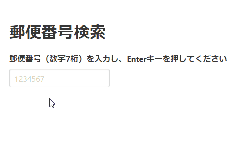
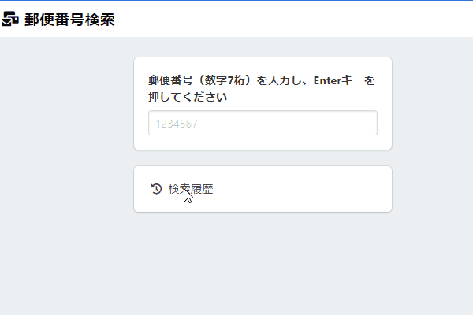

# vue-parcel-zipsearch とは？

作成日 2019/04/19

Vue.js+Parcelでつくる郵便番号検索アプリ（バージョン3種）

7桁の数字を入力してEnterキーを押すと、Ajax（非同期通信）で APIサーバーにアクセスしに行き、郵便番号に該当する地域を表示します。

郵便番号検索APIは、下記を使わせていただいています。

[郵便番号検索 API \- zipcloud](http://zipcloud.ibsnet.co.jp/doc/api)

クライアントサイドから直接アクセスしに行くと、CORSエラーが発生します。JSONPとして利用するという一工夫が必要です。

**axios** (HTTPクライアントライブラリ) に、**axios-jsonp**という axiosでJSONPを実現するライブラリを追加しています。

[axios\-jsonp \- npm](https://www.npmjs.com/package/axios-jsonp)

## バージョン3種の違い

- zipsearch1 ... CDNを使った、シンプルなバージョン
- zipsearch2 ... 1をParcelでバンドルしてみたバージョン
- zipsearch3 ... Parcelでバンドルし、見た目・機能を豪華にしたバージョン

### zipsearch1,2のスクリーン録画



### zipsearch3のスクリーン録画



## ファイル構成

```text
vue-parcel-zipsearch
  |
  |--zipsearch1     ... CDNを使ったシンプルなバージョン
  |   `--index.html
  |
  |--zipsearch2     ... 見た目は1と全く同じですが、Parcelでバンドルしているバージョン
  |   |--App.vue    ... アプリケーション本体
  |   |--index.html ... バンドルの起点となる共通ファイル
  |   `--index.js   ... バンドルの起点となる共通ファイル
  |
  |--zipsearch3                 ... Parcelでバンドルし、見た目も機能の豪華なバージョン
  |   |--components             ... 子コンポーネント群
  |   |   |--CorePart.vue       ... コアとなるパートを表示する
  |   |   |--LoadingModal.vue   ... ローダーを表示する
  |   |   |--MessageNotice.vue  ... メッセージを表示する
  |   |   `--NavMenu.vue        ... ナビゲーションメニューを表示する
  |   |
  |   |--modules                ... 状態を管理するモジュール群
  |   |   |--core.js            ... コアパートの状態と非同期通信を管理する
  |   |   |--loader.js          ... ローダーの状態を管理する
  |   |   `--message.js         ... メッセージの状態を管理する
  |   |
  |   |--App.vue                ... アプリケーション本体
  |   |--index.html             ... バンドルの起点となる共通ファイル
  |   `--index.js               ... バンドルの起点となる共通ファイル
  |
  |--package.json   ... npm用の設定ファイル
  `--README.md      ... このファイル
```

## 使い方

```bash
node -v # Node.jsがインストールされている必要がある

git clone git@github.com:isamusuzuki/vue-parcel-zipsearch.git # このプロジェクトをクローンする
cd vue-parcel-zipsearch # クローンしたディレクトリに進む
npm install # package.jsonに書かれたライブラリをインストールする

npm run dev:1 # zipsearch1が起動する、ブラウザで http://127.0.0.1:8080 を開く
npm run dev:2 # zipsearch2が起動する、ブラウザで http://localhost:1234 を開く
npm run dev:3 # zipsearch3が起動する、ブラウザで http://localhost:1234 を開く
```
